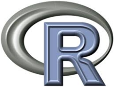

> ## 학습 목표 {.objectives}
>
> * 데이터 제품 사업 
> * 내부 제품기반 사업 모델
> * 외부 제품기반 사업 모델

Yasmin Lucero는 [UseR! 2014 컨퍼런스](http://user2014.stat.ucla.edu/)에서 R을 사용해서 사업화하는 방식에 대해 내부 제품과 외부 제품으로 나누어서 발표하였다.

### 내부 제품(Internal Product)  
 - 자료 분석 서비스 (one-off analytical product): 고객의 요구 사항에 기반하여 R을 사용해서 스크립트, 자료처리, 모형화, 그래픽과 문서를 제공하는 서비스 모형 [사례](http://rpubs.com/nathanesau1/21383
)
 - 보고서 자동화 (automated repots) : R + bash + email 혹은 R + markdown + web server와 같은 방식으로 ``자료 분석 서비스``와 유사하나 이를 스크립트로 작성하고 crontab과 bash script를 사용하여 변경되는 데이터에 대해 자동으로 보고서를 산출하여 전자우편이나 웹에 전달
 - 내부 R 패키지 (Internal R Package) : 공개되는 R 패키지와는 다르게 내부적으로 개발되는 R 패키지로 일종의 소프트웨어 제품으로 볼 수 있다.
 - 내부 대쉬보드 (internal dashboard) : EIS(Executive Information System)과 같이 데이터 분석 결과를 한 눈에 볼 수 있도록 대쉬보드 형태로 정리함.  

 ### 외부 제품(External Product)  
 - B2C 형태 웹앱 (customer facing web app) : 인터랙티브 웹 형식으로 고객이 제품을 직접 사용할 수 있는 제품형태로 배포함. [사례: 맥킨지](http://www.showmeshiny.com/)
 - 분석 엔진 (analytical back-end) : 분석 엔진 소프트웨어 제품형태로 만들어서 판매 [사례: card.com](https://www.card.com/)

> ## R 역사 {.callout}
>
> R은 S에 뿌리를 두고 있는 공개 소프트웨어다.

> ## 도전 과제 {.challenge}
>
> 제품과 서비스의 차이점을 논하시요.
> 소프트웨어 제품과 서비스의 차이점을 논하시요.
> 소프트웨어 제품/서비스와 R 제품 서비스 차이점을 논하시요.

