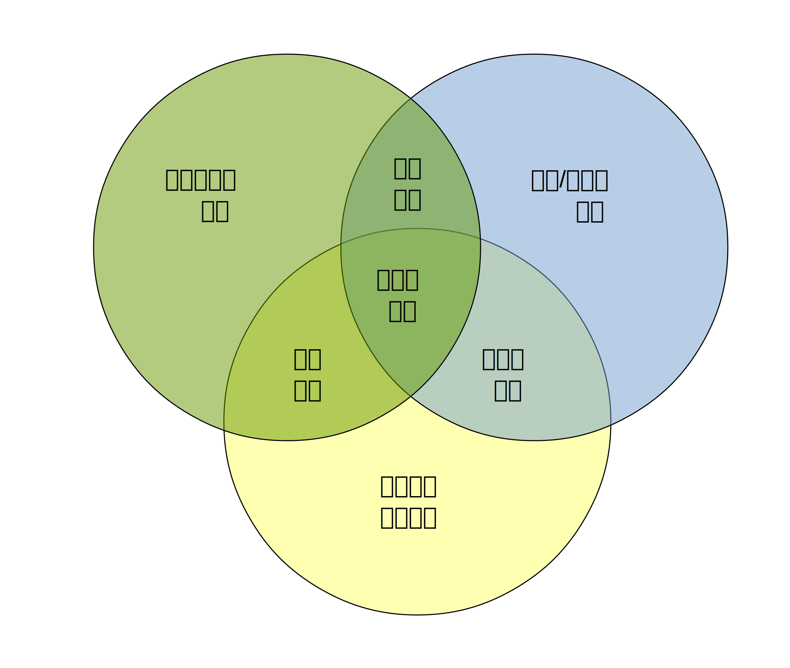
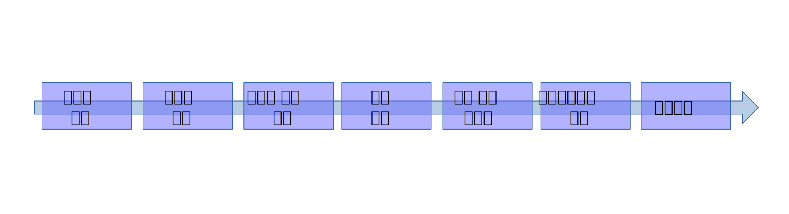

> ## 학습 목표 {.objectives}
>
> * 데이터 과학자 역량
> * 데이터 제품 개발

### 데이터 과학자 및 팀 역량
데이터 과학자가 갖추어야할 역량은 컴퓨터 과학, 수학/통계학, 특정 분야 전문지식 외에 기계학습, 소통 및 발표기술, 데이터 시각화등 다양한 역량이 필요하며, 콘웨이(Drew Conway)가 데이터과학 벤다이어그램으로 데이터과학 역량을 시각화하였다.

 - 컴퓨터 과학 (Computer science)
 - 수학 (Math)
 - 통계학 (Statistics)
 - 기계 학습 (Machine learning)
 - 특정 분야 업무지식 (Domain expertise)
 - 소통 및 발표 기술 (Communication and presentation skills)
 - 데이터 시각화 (Data visualization)

#### 데이터 과학팀 역량
훌륭한 데이터 과학 제품을 개발하고, 마케팅/판매, 운영, 소통을 위한 종합적인 역량이 필요하다. 데이터 과학 제품을 개발하기 위해서 개발팀을 구성하는데 컴퓨터 공학 전문가, 수학/통계학 전문가, 그래픽 디자이너, 특정분야 전문가 등 다양한 사람이 필요하다. [Harlan Harris, Sean Murphy, Marck Vaisman][1]은 각 개인의 역량과 데이터 과학팀 역량을 시각화하였다.

참고자료: Harlan Harris, Sean Murphy, Marck Vaisman, “Analyzing the Analyzers: An Introspective Survey of Data Scientists and Their Work”, O'Reilly, June 2013

### 데이터 제품 개발 방법론

제조업에서 목표로 하는 제품를 개발하는 방법론과 동일한 방법론을 **데이터 제품(Data Product)**에 적용한다. 데이터를 가지고 모델을 만든 후에 모델에 대해서 다양한 모의시험을 실시하고 제어변수를 통해 최적화를 진행한 후에 행동을 취한다.

<table>
  <tr><th>개발방법 이론</th><th>데이터 과학 구현</th></tr>
  <tr><td>1. 목표 설정한다.        </td><td>1. 데이터 제품 계획 수립 </td></tr>
  <tr><td>2. 제어변수를 명확히 한다.</td><td>2. 제어가능한 변수 판별</td></tr>
  <tr><td>3. 자료를 수집한다.      </td><td>3. 다양한 내외부 데이터 (Open API, HTML등)를 R 로 가져온다. </td></tr>
  <tr><td>4. 예측 모형을 생성한다.  </td><td>4. 통계모델 및 머신러닝을 활용하여 모델을 생성한다.</td></tr>
  <tr><td>5. 모의시험을 실행한다.   </td><td>5. Bootstrapping 모의시험을 수행한다.</td></tr>
  <tr><td>6. 최적화를 한다.        </td><td>6. 모형 정교화 및 데이터제품 최적화</td></tr>
  <tr><td>7. 행동(Action)을 취한다.</td><td>7. 생성된 모델을 Shiny등을 통해 클라우드로 배포한다.</td></tr>
</table>

> ## The Agile Manifesto {.callout}
>
> **Individuals and interactions** over processes and tools  
> **Working software** over comprehensive documentation  
> **Customer collaboration** over contract negotiation  
> **Responding to change** over following a plan  
>
>참고: Jurney, Russell. Agile Data Science: Building Data Analytics Applications with Hadoop. " O'Reilly Media, Inc.", 2013.

> ## 제품 디자인이란? {.callout}
>
> In the documentary The  Lost  Interview, Steve  Jobs  said  this  about design: 
> “Designing a product is keeping five thousand things in your brain and fitting them all together in new and different ways to get what you want. 
> And every day you discover something new that is a new problem or a new opportunity to fit these things together a little differently. And it’s that process that is the magic.” 
>
 
 
### 데이터 제품 개발 및 운영 프로세스

데이터 제품 개발 순서는 2단계 (Two-Phase) 모형으로 첫번째가 데이터 제품 개발(Development), 두번째가 데이터 제품 운영(Operations)단계로 나눌 수 있다.

1. 제품 개발 단계
    - 자료 수집 (Collecting data)
    - 자료 저장 (Storing data)
    - 자료 처리 (Processing data)
2. 제품 운영단계 
    - 자료 배포 (Publishing data)
    - 자료 상품화 (Decorating data)

이벤트는 다양한 형식으로 생성되는데 센서, 금융 거래, 응용프로그램 사용자 이력, 서버 로그 등이 포함된다. 이벤트를 통해서 생성된 원자료는 수집기(Collector)를 통해서 대용량 저장소, 실시간 스트리밍 데이터 큐로 채집된다. 대용량 저장소는 물리적 저장 위치로 아마죤 S3, 소프트웨어적으로는 하둡 분산 파일시스템(Hadoop Distributed FileSystem, HDFS)에 담겨진다. 하둡이 없었다면 오늘날 빅데이터는 아마 존재하기 어려웠을 것이다. 하둡에 담겨진 대용량 데이터를 처리한 다음 정제된 형태로 분산 문서 저장소에 담겨진다. MongoDB같은 NoSQL시스템을 사용해서 웹응용프로그램이나 다른 서버가 사용할 수 있는 형태로 보관되어 서비스를 제공한다. 응용서버는 Python/Flask나 Ruby/Sinatra 같은 경량 웹프레임워크를 사용해서 웹브라우져 요청이 있을 때 서비스를 제공한다.   
    

### R 소프트웨어

``S``는 1976년부터 벨연구소에서 자료분석을 위해서 인터랙트비 환경으로 개발된 언어로 1988년 ``S2``로 RA Becker, JM Chambers, A Wilks에 의해 발전되었으며, JM Chambers, TJ Hastie에 의해서 1992년 ``S3``로, JM Chambers에 의해 1998년 ``S4``로 진화되었다. AT&T/Lucent는 시애틀 소재 Insightful Corporation에 "S-plus"라는 제품으로 판매될 수 있는 독점 라이센스를 주었다. ``R``은 오클랜드 대학의 Ross Ihaka와 Robert Gentleman에 의해서 1990년부터 개발되다가 1997년 15명으로 구성된 국제적인 "R-Core"팀으로 개발되어오고 있다.

#### R 데이터 제품 툴 체인(Tool Chain)

데이터 제품을 만들기 위해서 세가지 툴을 준비해야 한다.  

 1. [R](http://cran.r-project.org/) : 데이터 분석 엔진이며 자료분석 DSL로 생산성이 매우 높다.  
 2. [RStudio](http://www.rstudio.com/) : ``R``기반 통합개발환경(IDE, Integrated Development Environment)   
 3. [Shiny](http://shiny.rstudio.com/) : ``R``과 ``RStudio``에 기반한 인터랙티브 웹응용프로그램 개발 및 운영 플랫폼.  

#### 기본 R 쉘 명령어
현재 작업공간을 확인하는 명령어는 getwd() 이며, 새로운 작업공간을 설정하는 명령어는 setwd() 이다. 현재 작업공간이 “C:\” 디렉토리인데 setwd() 명령어를 통해서 새로운 작업 공간으로 변경을 했다. 이것이 필요한 이유는 R은 기본적으로 자료처리 언어이기 때문에 데이터의 사전 위치를 파악하여 효율적으로 작업할 수 있다.

~~~ {.output}
> getwd()
[1] "C:/"
> setwd("D:/01. Work/09. Data_Products")
> getwd()
[1] "D:/01. Work/09. Data_Products"
> system("ls") # 윈도우에서는 shell("dir"), dir()
~~~

#### R 패키지(package) 설치
R의 강점은 다양한 패키지를 지원하므로 새로이 뭔가 필요한 것을 자체 개발하는 것보다 우선 다른 사람들이 해논 것을 참조하고 이를 확대하여 가는 것을 권장한다. R 패키지를 설치하는 방법에 대해서 알아보자. R Studio 상에서 R 패키지를 설치하는 방법은 메뉴 상단의 Tools > Install Packages… 를 클리하면 “Install Packages” 팝업 메뉴가 나오고 원하는 패키지를 설치하면 된다. rpart는 의사결정나무모델 (Decision Tree) 을 구현할 때 자주 사용되는 패키지로 별도로 개발할 필요없이 기존의 개발 검증된 rpart 패키지를 사용하는 것도 좋겠다. GUI를 통해서 일일이 설치하는 것도 좋지만, install.packages를 통한 명령어를 통해서도 설치가 동일하게 가능하다.

~~~ {.output}
> install.packages("rpart")
trying URL 'http://cran.rstudio.com/bin/windows/contrib/3.1/rpart_4.1-8.zip'
Content type 'application/zip' length 917885 bytes (896 Kb)
opened URL downloaded 896 Kb

package ‘rpart’ successfully unpacked and MD5 sums checked
The downloaded binary packages are in
	C:\Users\Administrator\AppData\Local\Temp\Rtmp4Ce7l1\downloaded_packages
~~~

#### R 맛보기

R이 설치되고, 필요한 패키지가 준비되면 분석에 사용할 데이터를 작업 메모리상에 올려야 한다. 분석 데이터를 R 작업공간에 준비하는 방법은 어려가지가 있다. Web URL을 활용한 웹 데이터를 가져오거나, ``read.table``을 이용한 로컬 디스크 상의 데이터를 메모리로 불러올 수 있다.

~~~ {.python}
> abalone <- read.csv(url("http://archive.ics.uci.edu/ml/machine-learning-databases/abalone/abalone.data"), header=F)
> names(abalone) <- c("Sex","Length","Diameter","Height","Whole weight","Shucked weight","Viscera weight","Shell weight","Rings")
> head(abalone)
~~~

~~~ {.out}
  Sex Length Diameter Height Whole weight Shucked weight
1   M  0.455    0.365  0.095       0.5140         0.2245
2   M  0.350    0.265  0.090       0.2255         0.0995
3   F  0.530    0.420  0.135       0.6770         0.2565
4   M  0.440    0.365  0.125       0.5160         0.2155
5   I  0.330    0.255  0.080       0.2050         0.0895
6   I  0.425    0.300  0.095       0.3515         0.1410
  Viscera weight Shell weight Rings
1         0.1010        0.150    15
2         0.0485        0.070     7
3         0.1415        0.210     9
4         0.1140        0.155    10
5         0.0395        0.055     7
6         0.0775        0.120     8
~~~

분석을 진행하기 위해서 간단한 R 스크립트를 작성하여 보자. 메뉴상단의 File > New File > R Script 혹은 “CTRL+SHIFT+N” 단축키를 사용하여 데이터 분석 결과를 스크립트로 작성하여 저장할 수 있다. 분석이 완료된 스크립트는 SimpleR.R로 저장한다.

~~~ {.python}
# Simple Analysis Sctript
abalone <- read.csv("abalone.csv")
table(abalone$Sex)
plot(Length ~ Sex, data=abalone)
~~~

~~~ {.out}
> # Simple Analysis Sctript
> abalone <- read.csv("abalone.csv")
> table(abalone$Sex)
   F    I    M 
1307 1342 1528 
> plot(Length ~ Sex, data=abalone)
~~~

자료 분석의 결과는 코드, 데이터, 그래프, 테이블로 나타나게 되며 이를 하나의 문서로 각각 정리하는 것은 매우 수고스러운 일이며 기본적으로 기계나 컴퓨터가 해야되는 일중의 하나이다. 이를 위해서 RStudio의 Notebook 기능을 사용한다. 먼저 R Studio의 Notebook 도 knitr 패키지와 Rmarkdown 같은 패키지를 기반으로 하지만 knitr 패키지를 설치하면 모든 의존성을 자동으로 해결해 준다. knitr 패키지를 설치한 후에 메뉴상단의 File > Compile Notebook… 을 클릭하면 팝업메뉴가 뜨며 제목과 저자를 표시하면 코드, 데이터, 그래프, 테이블 등 정리된 결과를 HTML 파일로 얻을 수 있다. 

~~~ {.python}
install.packages("knitr")
~~~

R 코드, 그림, 테이블, 텍스트와 함께 하나의 작업파일로 데이터 제품을 만들 수 있다. Notebook, Markdown, HTML, LaTex 등 총 4가지 방법이 있으나 RStudio를 사용할 경우 Built-in 된 Notebook을 사용하는 것도 좋은 방법이며, Markdwon, LaTex, HTML등 친숙한 방법을 사용할 수도 있다.

<table>
  <tr><th>Markup 시스템</th><th>입력파일(Input)</th><th>리포트파일(Output)</th></tr>
  <tr><td>Notebook</td>.R<td></td><td>.html (.md 경유)</td></tr>
  <tr><td>Markdown</td>.Rmd<td></td><td>.html (.md 경유)</td></tr>
  <tr><td>HTML</td><td>.Rhtml</td><td>.html</td></tr>
  <tr><td>LaTeX</td><td>.Rnw</td><td>.pdf (.tex 경유)</td></tr>
</table>

RStudio_RMarkdown 을 이용하여 작업파일을 만든 후에 “knit HTML” 버튼을 누루면 HTML 파일을 바로 얻을 수 있다. 

어느 소프트웨어도 마찬가지지만 사용하다보면 오류가 발생하고 이를 확인해야 할 때가 있다. ``RStudio``의 경우 “Help>Diagnostics>Show log files” 를 통해서 확인가능하다. ``R``과 ``Rstudio`` 관련 도움말은 google 검색이나, [stack exchange](http://stackexchange.com/)를 통해 얻을 수 있다. 작업을 하다면 콘솔화면을 깨끗이하고 다시 시작하고 싶은 경우가 있다. 윈도나 도스의 경우 ``cls`` 명령어가 있는데 R에는 딱히 그런 명령어가 없다. 이런 경우 사용자 정의 함수를 하나 만들어서 실행할 수 있다. 

~~~ {.python}
> cls <- function() cat(rep("\n",50))
> cls()
~~~

하지만, 매번 R을 실행할 때마다 반복적으로 해야되기 때문에 R이 시작될 때 자동으로 설정을 하는 방법은 초기 실행 환경파일에 이를 적용하는 것이다. C:\Program Files\R\R-3.1.0\library\base\R\RProfile 파일을 텍스트 편집기로 열어 하단에 ``cls`` 함수를 적어두고 저장한다. ``혹은 CTRL+L`` 키를 눌러 화면을 깨끗이하며 커서를 맨 위 상단으로 이동한다.

~~~ {.python}
….
local({
    br <- Sys.getenv("R_BROWSER", NA_character_)
    if(!is.na(br)) options(browser = br)
    tests_startup <- Sys.getenv("R_TESTS")
    if(nzchar(tests_startup)) source(tests_startup)
})

# User Defined Functions
cls <- function() cat(rep("\n",50))
~~~

#### R 데이터 관리 (Data Manipulation)

##### 모드(mode)와 클래스(class)
모드 함수는 객체의 모드를 리턴하고, 클래스 함수는 클래스를 리턴한다. 가장 흔하게 만나는 객체 모드는 숫자, 문자, 로직 모드다. 때때로 리스트와 데이터프레임과 같이 하나의 객체안에 여러 모드를 포함하기도 한다. 
범주형 자료를 R에 저장하기 위해서 요인(Factor) 클래스를 사용하며 요인 클래스를 사용하여 자료를 저장할 경우 저장공간을 절약할 수 있다. 요인은 내부적으로 숫자(value)로 저장을 하고 레이블(value label)을 사용하여 표시를 하여 저장공간을 절약한다.
날짜와 시간도 중요한 데이터자료형니다.
리스트(List)는 데이터를 저장하는 유연하며 강력한 방법으로 sapply 함수와 함께 가장 빈번하게 사용되는 데이터 타입니다. 리스트형 자료 mylist를 세가지 숫자형, 문자형, 팩터형 세가지 데이터 형을 포함하게 작성하였다. sapply 함수를 이용하여 mode와 class 인자를 줌으로써, 각각의 데이터 형의 모드와 클래스를 확인할 수 있다.

~~~ {.python}
> mylist = list(a=c(1,2,3),b=c("cat","dog","duck"), d=factor("a","b","a"))
> sapply(mylist,mode)
          a           b           d 
  "numeric" "character"   "numeric" 
> sapply(mylist,class)
          a           b           d 
  "numeric" "character"    "factor" 
> factor2 <- factor(c(1,2,3,4,5,6,7,8,9),labels=letters[1:9])
> factor2
[1] a b c d e f g h i
Levels: a b c d e f g h i
> levels(factor2)
[1] "a" "b" "c" "d" "e" "f" "g" "h" "i"
> labels(factor2)
[1] "1" "2" "3" "4" "5" "6" "7" "8" "9"
~~~

##### 정의된 데이터 형식에 맞게 데이터 저장
가장 간단하게 자료를 저장할 수 있는 벡터 ``c`` 함수(concatenate or combine)로 시작해 봅시다. 1,2,5,10을 벡터 함수 ``c``로 합쳐서 mode 함수를 확인하니 숫자형이 된다. 숫자가 문자가 합쳐진 y는 문자 자료 형식이 됩니다. 숫자와 논리 자료형이 합쳐진 경우는 숫자가 됩니다. 벡터를 합쳐서 all 과 같이 활용도 가능하며 당연히 문자 자료형이 된다.

~~~ {.python}
> x = c(1,2,5,10)
> x
[1]  1  2  5 10
> mode(x)
[1] "numeric"
> y = c(1,2,"cat",3)
> y
[1] "1"   "2"   "cat" "3"  
> mode(y)
[1] "character"
> z = c(5,TRUE,3,7)
> z
[1] 5 1 3 7
> mode(z)
[1] "numeric"
> all = c(x,y,z)
> all
 [1] "1"   "2"   "5"   "10"  "1"   "2"   "cat" "3"   "5"   "1"  "3"   "7"
> mode(all)
[1] "character"
~~~

R은 6가지 기본 벡터 자료 저장 형식을 가지고 있다. 이와는 다른 행렬(matrix), 데이터프레임(data.frame), 리스트(list)가 있다.

<table>
  <tr><th>자료형(Type)</th><th>모드(Mode)</th><th>저장모드(Storage Mode)</th></tr>
  <tr><td>logical</td><td>logical</td><td>logical</td></tr>
  <tr><td>integer</td><td>numeric</td><td>integer</td></tr>
  <tr><td>double</td><td>numeric</td><td>double</td></tr>
  <tr><td>complex</td><td>complex</td><td>complex</td></tr>
  <tr><td>character</td><td>character</td><td>character</td></tr>
  <tr><td>raw</td><td>raw</td><td>raw</td></tr>
</table>

자료분석을 위해서 자료를 데이터셋의 형태로 구성을 해야한다. 데이터셋이 중요한 이유는 자료를 분석하기 위해서 다양한 형태의 개별 자료를 통합적으로 분석하기 위해서다. 이를 위해서 리스트 자료구조로 일단 모으게 된다. 예를 들어 개인 신용분석을 위해서는 개인의 소득, 부채, 성별, 학력 등등의 숫자형, 문자형, 요소(Factor)형 등의 자료를 데이터셋에 담아야 한다. 특히 변수와-관측값 (Variable-Observation) 형식의 자료를 분석하기 위해서는 데이터프레임(``data.frame``)을 자주 사용한다. 데이터프레임은 모든 변수에 대해서 관측값이 같은 길이를 갖도록 만들어 놓은 것이다. 

##### 데이터 형식 테스트

각각의 데이터 형식에 맞는지를 다양한 테스트 함수를 이용하여 데이터 형식을 확인할 수 있다. 

- is.list: 리스트 형식인 확인
- is.factor: 팩터 형식인지 확인
- is.numeric: 숫자형인지 확인
- is.data.frame: 데이터 프레임형인지 확인
- is.character: 문자형인지 확인
 
##### R 객체의 구조 파악

간단한 자료는 데이터 형식을 확인할 수 있는 1~2줄 정도의 간단한 스크립트와 명령어를 통해서 확인이 가능하지만 복잡한 데이터의 구조를 파악하기 위해서는 summary 함수와 str 함수를 통해서 확인해야 한다.

~~~ {.python}
> mylist = list(a=c(1,2,3),b=c("cat","dog","duck"),d=factor("a","b","a"))
> summary(mylist)
  Length Class  Mode     
a 3      -none- numeric  
b 3      -none- character
d 1      factor numeric  
> str(mylist)
List of 3
 $ a: num [1:3] 1 2 3
 $ b: chr [1:3] "cat" "dog" "duck"
 $ d: Factor w/ 1 level "a": NA
~~~

##### R 코딩 규칙

R 코드를 가독성이 좋으며 이해하기 쉽게 일관되게 작성하는 것이 중요하다. 코딩 규칙에 대한 자세한 사항은 [The State of Naming Conventions in R][2] 참조한다.

- [Bioconductor’s coding standards](http://wiki.fhcrc.org/bioc/Coding_Standards)
- [Hadley Wickham’s style guide](http://stat405.had.co.nz/r-style.html)
- [Google’s R style guide](http://google-styleguide.googlecode.com/svn/trunk/google-r-style.html)
- [Colin Gillespie’s R style guide](http://csgillespie.wordpress.com/2010/11/23/r-style-guide/)

##### 데이터 정제 (Data Manipulation)

**plyr**:  split-apply-combine Strategy

1. Split the iris dataset into three parts.  
2. Remove the species name variable from the data.  
3. Calculate the mean of each variable for the three different parts separately.  
4. Combine the output into a single data frame.  

<table>
  <tr><th>R</th><th>구글</th></tr>
  <tr><td>split</td><td>Map</td></tr>
  <tr><td>apply</td><td>Map</td></tr>
  <tr><td>combine</td><td>Reduce</td></tr>
</table>

출처: Hadley Wickham, "The Split-Apply-Combine Strategy for Data Analysis" Journal of Statistical Software April 2011, Volume 40, Issue 1, [http://www.jstatsoft.org/v40/i01/paper](http://www.jstatsoft.org/v40/i01/paper)

**전통적 방법**  

~~~ {.python}
> # notice that during split step a negative 5 is used within the  
> # code, this negative 5 has been used to discard fifth column of t
> # iris data that contains "species" information and we do not need
> # that column to calculate mean.
> iris.set <- iris[iris$Species=="setosa",-5]
> iris.versi <- iris[iris$Species=="versicolor",-5]
> iris.virg <- iris[iris$Species=="virginica",-5]
> # calculating mean for each piece (The apply step)
> mean.set <- colMeans(iris.set)
> mean.versi <- colMeans(iris.versi)
> mean.virg <- colMeans(iris.virg)
> # combining the output (The combine step)
> mean.iris <- rbind(mean.set,mean.versi,mean.virg)
> # giving row names so that the output could be easily understood
> rownames(mean.iris) <- c("setosa","versicolor","virginica")
> mean.iris
~~~

~~~ {.output}
           Sepal.Length Sepal.Width Petal.Length Petal.Width
setosa            5.006       3.428        1.462       0.246
versicolor        5.936       2.770        4.260       1.326
virginica         6.588       2.974        5.552       2.026
~~~

**split-apply-combine 루프 방법**  

~~~ {.python}
> # split-apply-combine using loop
> # each iteration represents split 
> # mean calculation within each iteration represents apply step
> # rbind command in each iteration represents combine step
> mean.iris.loop <- NULL
> for(species in unique(iris$Species))
+ {
+     iris_sub <- iris[iris$Species==species,]
+     column_means <- colMeans(iris_sub[,-5])
+     mean.iris.loop <- rbind(mean.iris.loop,column_means)
+ } 
> # giving row names so that the output could be easily understood
> rownames(mean.iris.loop) <- unique(iris$Species)
> mean.iris.loop
~~~

**plyr 라이브러리**를 사용해서 동일한 작업을 plyr 라이브러리를 활용하여 몇줄의 코드로 할 수 있다.

~~~ {.python}
> library (plyr)
> ddply(iris,~Species,function(x) colMeans(x[,-which(colnames(x)=="Species")]))
     Species Sepal.Length Sepal.Width Petal.Length Petal.Width
1     setosa        5.006       3.428        1.462       0.246
2 versicolor        5.936       2.770        4.260       1.326
3  virginica        6.588       2.974        5.552       2.026
~~~

##### 데이터 재정의 (Data Reshape)

데이터를 재정의하여 원하는 자료 형식을 얻는 방식은 ``reshape`` 패키지를 이용하는 방법과 ``sqldf``를 사용하는 방식이 있다. ``sqldf``는 "sql DSL(Domain Specific Language)"를 재사용할 수 있다는 측면과 ``sqlite``를 사용할 경우 기존 ``R``명령어를 조합하는 것에 비하여 속도향상을 기대할 수 있다.

**``Reshape`` 패키지**  

Hadley Wickham, "Reshaping Data with the reshape Package", Journal of Statistical Software, November 2007, Volume 21, Issue 12. [http://www.jstatsoft.org/v21/i12/paper](http://www.jstatsoft.org/v21/i12/paper)  
통계분석자료는 행과 열로 구성되며, 행은 관측점을 열은 관측점의 정보를 담고있는 변수, 특징등으로 구성된다. 열정보 변수는 식별변수 (identifier variable)과 측정변수(measured variable)로 구성된다. 열정보 변수가 식별변수로 저장된 경우 프라이머리 키로 통상 불리우는 식별변수의 경우 범주형 정보로 나타나고, 측정변수의 경우는 관심있는 정보를 담게된다.자료를 관측값 중심으로 자료를 수학/국어/영어의 영역으로 나누어 저장할 경우 많은 열을 가진 테이블 형식으로 저장된다.

~~~ {.python}
> # Example of typical two dimensional data
> # A demo dataset "students" with typical layout. This data  
> # contains two students' exam score of "math", "literature"  
> # and "language" in different term exam.
> students <- data.frame(sid=c(1,2),
+                        math.1=c(50,65),
+                        literature.1=c(40,45),
+                        language.1=c(70,80),
+                        math.2=c(75,69),
+                        literature.2=c(55,59),
+                        language.2=c(75,78))
> students
  sid math.1 literature.1 language.1 math.2 literature.2 language.2
1   1     50           40         70     75           55         75
2   2     65           45         80     69           59         78

> students <- data.frame(sid=c(1,1,2,2),
+                        exmterm=c(1,2,1,2),
+                        math=c(50,65,75,69),
+                        literature=c(40,45,55,59),
+                        language=c(70,80,75,78))
> students
  sid exmterm math literature language
1   1       1   50         40       70
2   1       2   65         45       80
3   2       1   75         55       75
4   2       2   69         59       78
> molten_students <- melt.data.frame(students,id.vars=c("sid","exmterm"))
> molten_students
   sid exmterm   variable value
1    1       1       math    50
2    1       2       math    65
3    2       1       math    75
4    2       2       math    69
5    1       1 literature    40
6    1       2 literature    45
7    2       1 literature    55
8    2       2 literature    59
9    1       1   language    70
10   1       2   language    80
11   2       1   language    75
12   2       2   language    78
~~~

**sqldf 패키지**   

``sqldf``를 사용할 경우 database를 신규로 생성할 필요가 없으며, 데이터베이스로부터 import export가 불필요하며 특정열을 다루는데 있어서 편리한 점이 있다.

~~~ {.python}
> library(sqldf)
> subiris<- sqldf("select * from iris where Sepal_Width> 3")
> head(subiris)
  Sepal_Length Sepal_Width Petal_Length Petal_Width Species
1          5.1         3.5          1.4         0.2  setosa
2          4.7         3.2          1.3         0.2  setosa
3          4.6         3.1          1.5         0.2  setosa
4          5.0         3.6          1.4         0.2  setosa
5          5.4         3.9          1.7         0.4  setosa
6          4.6         3.4          1.4         0.3  setosa
> subiris2<-
+ sqldf("select Sepal_Length,Petal_Length,Species from iris where Petal_length> 1.4")
> nrow(subiris2)
[1] 126
> head(subiris2)
  Sepal_Length Petal_Length Species
1          4.6          1.5  setosa
2          5.4          1.7  setosa
3          5.0          1.5  setosa
4          4.9          1.5  setosa
5          5.4          1.5  setosa
6          4.8          1.6  setosa
~~~

[1]: http://www.oreilly.com/data/free/files/analyzing-the-analyzers.pdf 
[2]: http://journal.r-project.org/archive/2012-2/RJournal_2012-2_Baaaath.pdf

