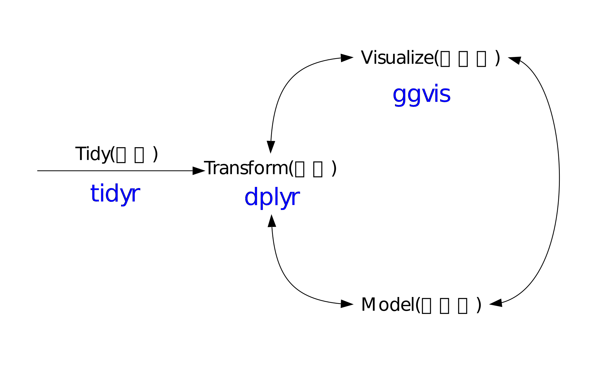

> ## 학습 목표 {.objectives}
>
> * R 데이터 처리 기본 개념
> * SQL 기본 개념 
> * 쉘 파이프-필터 데이터 정제 자동화

### R 자료 구조

자료는 기본적으로 벡터(Vector)를 기본으로 한다. 하지만 벡터로 표현될 수 있는 정보량은 한정되어 있으며 이를 하나의 자료 형태로 구조화한 것을 데이터프레임(dataframe)으로 볼 수 있다. 따라서, 자료분석을 위한 기본 자료형태를 데이터프레임으로 놓는다. 

~~~ {.r}
for (i in collection-x) {
    for (j in collection-y) {
        df <­ func(df,i,j)
    }
}
~~~

R을 사용하는 방법중 하나는 반복을 통해 한번에 하나씩 연산을 수행하기 보다는 단 한번 호출(call)을 통해서 전체 벡터 연산을 수행한다. 또한 apply 함수를 사용해서 행, 열, 리스트에 대해서도 마찬가지다. 또한 reduce를 사용해서 함수형 프로그래밍도 확장해서 수행한다.
~~~ {.r}
# for 루프를 돌려 연산을 수행
for (i in 1:N) { sum.result[i] <­ A[i] + B[i] }
# Vectorized 연산자를 사용해서 연산을 수행
sum.result <­- B + C
~~~

R에서 제공하는 기본적인 벡터 연산자는 A+B, A­B, A*B, A/B, A%%B가 있다.
R은 추가적으로 벡터 연산자(Vectorized Operators)를 제공하는 몇 안되는 언어다. 몇 안되는 언어에는 매트랩(Matlab)이 포함되어 있다. 벡터 연산자가 유용한 이유는 반복 루프(loop)를 돌리지 않아도 덧셈, 곱셉 등 필요한 연산을 직관적으로 수행할 수 있다는 장점이 있다. 또한, apply, sapply, tapply, mapply 등 강력한 함수도 제공한다.  

#### apply 함수

 - lapply(lst,fun) : 리스트형 자료에 apply 함수를 적용하여 자료를 처리한다.
 - sapply(lst,fun) : lappy 함수와 동일하나 리스트 대신에 벡터를 반환한다.
 - mapply(fun,lst1,lst2,...) : 병렬로 다수 리스트에 대해서 apply 함수로 자료를 처리한다.
 - tapply(x,factor,fun) : 그룹 변수(factor)에 맞춰 apply 함수로 자료를 처리한다. 
 - vapply(lst,fun,...) : lappy의 고속처리 버젼.

그 외에도 다양한 패키지를 파이썬과 마찬가지로 제공하여 R을 선택하는 순간 자료 분석, 모형화, 제품화에 대해 강력한 무기를 손에 넣게 된다. 가공되지 않은 원자료(raw data)에서 자료를 원하는 방향에 맞춰서 자유자재로 다루기 위해서 다양한 방법이 존재하고 이를 위해 수십년동안 수많은 공학자들이 아낌없이 시간을 투자했으며 그 기반위에 현재가 있다. 특히 SQL을 통해서 개념적인 부분을 잡고 쉘을 통한 자동화 개념을 익히고 이를 구현한 R 패키지를 사용하면 원하는 바에 쉽게 접근할 수 있다. 범용 자료처리를 위한 [hadley wickham](http://www.had.co.nz/)이 작성한 dplyr을 기본으로 설명한다.

 - 시계열 자료(time series) : zoo, xts, lubridate
 - 지리정보 자료(geospatial data) : sp/maptools
 - 범용 자료 처리 : reshape2/plyr/dplyr/tidyr
 
### SQL 자료처리

자료를 원하는 방향으로 처리하기 위해서는 다음과 같은 다양한 기본적인 자료 처리 방법을 조합하여 사용한다.

 - 데이터 선택하기
 - 정렬과 중복 제거하기
 - 필터링(filtering)
 - 새로운 값 계산하기
 - 결측 데이터 (Missing Data)
 - 집합 (Aggregation)
 - 데이터 조합하기 (Combining Data)

~~~ {.r}
# 칼럼과 행 선택
SELECT column1, column2....columnN
FROM   table_name
WHERE  CONDITION;

# 그룹에 따른 정렬 및 집합(aggregation)
SELECT SUM(column_name)
FROM   table_name
WHERE  CONDITION
ORDER BY column_name {ASC|DESC};
GROUP BY column_name;
~~~

### R 프로그래밍 Best Practices

[Martin Maechler](http://datascience.la/martin-maechler-invited-talk-at-user-2014-good-practices-in-r-programming/) useR 2014 컨퍼런스에서 "Good Practice in R Programming" 주제로 발표를 했습니다.  

 + Rule 1. Work with source files !  
    - 원본 소스 파일(R Script) 작업하고 이를 통해 객체나 바이너리 산출물 생성로 일원화  
    - Emacs + ESS(Emacs Speacks Statistics) 혹은 Rstudio 같은 IDE(Integrated Development Environment) 사용

 + Rule 2. Keep R source well-readable and maintainable
    - 가독성이 뛰어난 소스 코드는 나중에 유지 보수하기 좋다.
    - 들여쓰기(identation), 공백, 70~80 칼럼, 주석처리(하나(``#``)는 코드 끝에, 두개(``##``)는 일반 주석, 세개(``###``)는 코드 블록에 사용)
    - Sweave 혹은 knitr을 사용한다.
    - naming convention을 따른다.

 + Rule 3. Do read the documentation
    - R 프로그래밍 책을 읽는다.화 V&R "S Programming"
    - R 매뉴얼 참조 : An introduction to R, Writing R extentions
    - R 패키지 Vignettes
    - help.search()
 + Rule 4. Do learn from the masters
    - John Chambers, Bill Venables, Bill Dunlap, Luke Tierney, Brian Riply, R-core team, Dirk Eddelbuettel, Hadley Wickham
    - 다른 사람이 작성한 코드를 읽고 배운다. 일종의 Learning by examples.
    - 부활절 달걀(Easter egg)를 찾아라.
    - [Uwe Ligges, "R Help Desk", The Newsletter of the R Project Volume 6/4, October 2006](http://www.r-project.org/doc/Rnews/Rnews_2006-4.pdf)
    
~~~ {.r}
> anybody ? there ???
+ ?
+ ''
~~~

~~~ {.output}
Contacting Delphi...the oracle is unavailable.
We apologize for any inconvenience.
~~~

 + Rule 5. Do not Copy and Paste!
    - 이유는 유지보수성이 좋지 않고 복사하면 확장성, 이동성이 떨어진다.
    - 함수(function)을 작성하고, 큰 함수는 잘게 쪼개 작은 함수로 나누어 작성하고, 함수를 사용한다. 

> ## John Chambers {.callout}
>
> Everything that **exists** is an object;  
> Everything that **happens** is a function call.

 + Rule 6. Strive for clarity and simplicity
   - 자기설명가능한 변수명 사용하고, 간결하게 주석을 섞어 작성
   - 모듈방식 작성   

> ## Venables and Ripley {.callout}
>
> ''Refine and polish your code in the same way you would polish your English prose''

 + Rule 7. Test your code !
    - 단위 테스트, 모듈
    - ``package.skeleteon()``을 통한 패키지 작성: auto-testing, specific testing, documentation.
    - R 패키지 ``tools``의 ``R CMD check`` 사용, Luke Tierney ``codetools`` 사용
    - 단위 테스트 패키지 ``RUnit``, ``testthat`` 사용
    - 테스트 후에 최적화
    - 최적화에 두가지 원칙: 
        * Don't do it unless you need it.
        * Measure, don't guess, about the speed
    - ``Rprof()``, ``unix.time()``, ``gc()``, R 패키지 ``rbenchmark``, ``microbenchmark``, ``pdbPROF``.

##### 새로 추가된 안내지침
 + Rule 8. Maintain R code in **Packages** (extension of "Test!")
 + Rule 9. Source code management, Git/GitHub, HG
 + Rule 10. Rscript or R CMD BATCH *.R should "always" work ! -> Reproducible Data Analysis and Research

### Hadley Wickham이 제시하는 자료분석 체계

Hadley Wickham은 tidyr을 사용하여 자료 정제하고 자료변환을 위해서 dplyr을 사용하고 그래픽 문법(glammar of graphics)에 따라 ggvis로 시각화하고 R의 다양한 모형화를 이용한 자료분석 체계도를 제안한다. 시각화(Visualization)는 데이터에 대한 통찰력(insight)과 탄성, 놀라움을 줄 수 있지만, 확장성(Scalability)는 떨어진다. 왜냐하면, 사람이 데이터분석 루프에 포함되기 때문에 확장 및 자동화에 한계가 있다. 반대로 모형(Model)화는 자동화와 확장성에는 장점이 있지만, 주어진 모형틀안에서 이루어지기 때문에 통찰력, 놀라움, 탄성을 주지는 못한다. 

#### dplyr

[dplyr](http://cran.r-project.org/web/packages/dplyr/dplyr.pdf) 패키지는 데이터프레임(data.frame) 자료처리를 위한 차세대 plyr 패키지다. 다음 6가지 함수가 핵심 함수로 SQL 기본 기능과 유사성이 크다. 따라서, 기존 다양한 자료처리 방식을 직관적이며 빠르며 효율적인 dplyr 패키지 함수로 생산성을 높여본다.

 - filter (관측점 필터링) : 특정 기준을 만족하는 행을 추출한다.
 - select (변수 선택하기) : 변수명으로 특정 칼럼을 추출한다.
 - arrange (다시 정렬하기) : 행을 다시 정렬한다.
 - mutate (변수 추가하기) : 새로운 변수를 추가한다. 
 - summarise (변수를 값으로 줄이기) : 변수를 값(스칼라)으로 요약한다.
 
#### 관측점(obervation) 필터링해서 선택하기 (filter)

<table>
  <tr><th>전통적 방법</th><th>dplyr 방법</th></tr>
  <tr><td>df[df$var01==3 & df$var02$==7]</td><td>filter(df, var01==3, var02==7</td></tr>
</table>

~~~ {.r}
df <- data.frame( 
  color = c("blue", "black", "blue", "blue", "black"), 
  value = 1:5) 
filter(df, color == "blue")
filter(df, value %in% c(1, 4))
~~~

#### 특정 변수 선택하기 (select)
<table>
  <tr><th>전통적 방법</th><th>dplyr 방법</th></tr>
  <tr><td>df[df$var01==3 & df$var02$==7]</td><td>filter(df, var01==3, var02==7)</td></tr>
</table>

~~~ {.r}
select(df, color)
select(df, -color)
~~~

#### 다시 정렬하기 (arrange)
<table>
  <tr><th>전통적 방법</th><th>dplyr 방법</th></tr>
  <tr><td>df[order(df$var01, df$var02)]</td><td>arrange(df, var01, var02)</td></tr>
</table>
~~~ {.r}
arrange(df, color)
arrange(df, desc(color))
~~~

#### 새변수 생성하기 (mutate)
<table>
  <tr><th>전통적 방법</th><th>dplyr 방법</th></tr>
  <tr><td>df$new <- df$var01/df$var02</td><td>df <- mutate(df, new=var01/var02)</td></tr>
</table>
~~~ {.r}
mutate(df, double = 2 * value)
mutate(df, double = 2 * value, quadruple = 2 * double)
~~~

#### 변수 요약하기 (summarize)
<table>
  <tr><th>전통적 방법</th><th>dplyr 방법</th></tr>
  <tr><td>aggregate(df$value, list(var01=df$var01), mean)</td><td>group_by(df, var01) %.% summarize(totalvalue = sum(value))</td></tr>
</table>
~~~ {.r}
summarise(df, total = sum(value))
by_color <- group_by(df, color) 
summarise(by_color, total = sum(value))
~~~

> 요약 통계량 함수
> min(x), median(x), max(x), quantile(x, p)   
> n(), n_distinct(), sum(x), mean(x)   
> sum(x > 10), mean(x > 10)   
> sd(x), var(x), iqr(x), mad(x)  

#### 파이프-필터 자료 처리 이유

> ## 함수형 언어 인터페이스 단점 {.callout}
>
> hourly_delay <- filter( 
>  summarise( 
>    group_by( 
>      filter( 
>        flights,  
>        !is.na(dep_delay) 
>      ),  
>      date, hour 
>    ),  
>    delay = mean(dep_delay),  
>    n = n() 
>  ),  
>  n > 10 
> )

유닉스 파이프-필터 [magrittr]()를 사용한다. ``%>%``은 "then"으로 발음한다.

~~~ {.python}
hourly_delay <- flights %>%  
  filter(!is.na(dep_delay)) %>% 
  group_by(date, hour) %>% 
  summarise(delay = mean(dep_delay), n = n()) %>%  
  filter(n > 10) 
~~~

